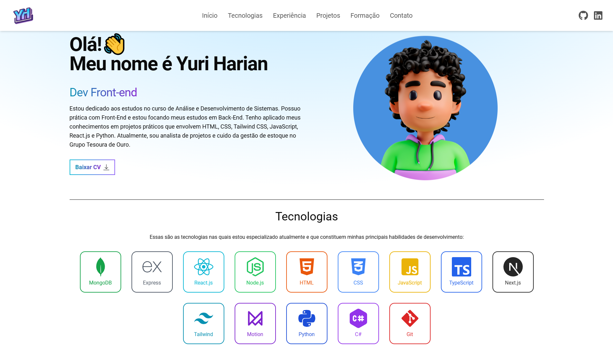

# Portfólio de Yuri Harian

Este é o repositório do meu portfólio pessoal, onde apresento meus projetos, habilidades e informações de contato. Este projeto foi desenvolvido com o intuito de mostrar meu progresso como desenvolvedor Front-end e está em constante atualização.

## Tecnologias Utilizadas

- **React.js**: Biblioteca JavaScript para a construção de interfaces de usuário.
- **Tailwind CSS**: Framework CSS utilitário para estilização rápida e eficiente.
- **Framer Motion**: Biblioteca para animações fluidas e interativas no React.
- **React Icons**: Conjunto de ícones populares para enriquecer a interface.

## Recursos Principais

- Apresentação de projetos com descrição, tecnologias usadas e links para o código-fonte e deploy.
- Animações suaves e interativas, implementadas com Framer Motion.
- Responsividade completa, ajustando o layout para diferentes tamanhos de tela.
- Navbar dinâmica com menu para dispositivos móveis.

## Planos Futuros

- **Integração de i18n**: No futuro, pretendo adicionar suporte a vários idiomas, usando bibliotecas como `react-i18next` para tornar o portfólio acessível a uma audiência internacional.
- **Novos Projetos**: Adicionar mais projetos à medida que são desenvolvidos.
  
## Screenshot

---

### Contato

- **LinkedIn**: [Yuri Harian](https://linkedin.com/in/yuri-harian)
- **E-mail**: [yuri_harian@outlook.com](mailto:yuri_harian@outlook.com)
